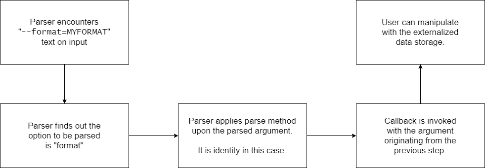

# Command Line Parser Library

Thanks for installing our library! We hope you will enjoy using it and possibly leave us some positive feedback. In the next sections, we provide a short tutorial on how to use the library conveniently.

## Main Idea
To parse the options, we use callback mechanism:
* The callback is called once the option is succesfully parsed.
* Parameters for options are strongly-typed.
* The library predefines parse methods for common types (e.g., `string` or `int`).
    * However, parse method for user-defined type can be supplied.
    * In both cases, callback is invoked with argument corresponding to result of the parse
method.

The diagram below briefly summarizes how the parsing works.



## Set-up

**Step 1**: The parser is meant to be set-up using several builder instances. The only builder you need to instantiate by yourself is `CommandLineParserBuilder`. Therefore, it is enough to call the parameterless constructor and store the instance to some local variable:

```
var parserBuilder = new CommandLineParserBuilder();
```

Note that there is also a constructor accepting a `string` argument, which specifies name of the command being parsed. This is further accessible from [help text](#help).

```
var parserBuilder = new CommandLineParserBuilder("MyCommand");
```

**Step 2**: Now it is time to set-up parse methods. Parse methods for all the primitive types are registred automatically. Among these types are, for example, `string`, `int`, `double` or `bool`. All the predefined parse methods can be overriden with custom ones.

However, having these types only would have been too limiting. Therefore, you can set parse methods for your custom types. Consider the following class:

```
class WorkingDays
{
    public bool Monday { get; }
    public bool Tuesday { get; }
    ...
}
```

Weekdays can be coded into some string instance somehow. For example, n-th character can correspond to n-th weekday. In such example, the string `1001000` would mean that the company works on Monday and on Thursday.

Thanksfully, we can implement a parse method to handle this, it can have the signature `WorkingDays ParseWorkingDays(string input);`.

Now, we can register the method into the parser using the following piece of code:

```
parserBuilder.RegisterParser<WorkingDays>(ParseWorkingDays);
```

which is equivalent to:

```
parserBuilder.RegisterParser<WorkingDays>((string input) => ParseWorkingDays(input));
```

**Step 3**: We can finally set-up the options. We will demonstrate it on few examples:

1. Consider the following code:
    ```
    string parsedFormat;
    parserBuilder.SetupOption<string>(OptionFactory.Short('f'), OptionFactory.Long("format"))
        .WithDescription("Some description.")
        .Callback(format => parsedFormat = format)
        .ParameterRequired();
    ```
    In the code above, we have registered so called *parametrised option* into the parser.

     * The `string` type argument says that the parsed input is of a type `string`. Recalling the previous step, we could have `WorkingDays` type argument here. Then, `ParseWorkingDays` method would be used to parse the input.
     * The `SetupOption<T>` method accepts an unlimited amount of `Option` instances, defining aliases.
        * The long option is expanded to, e.g., `--test=TEST`.
        * The short option is expanded to, e.g., `-t TEST`.
    * The `WithDescription` method accepts a `string` instance representing description of the option. This is further accessible from [help text](#help).
    * The `Callback` method registers a callback which is called if the option is successfully parsed. In this case, once the option is parsed, its argument value is stored into `parsedFormat` local variable.
    * The `ParameterRequired` method sets the option's parameter to be required. In parametrised option, it is optional by default. If the parameter is required, but it is not present at input, the `IncorrectInputException` is thrown.

2. Consider the following code:
    ```
    parserBuilder.SetupOption(Short('p'), Long("portability"))
        .WithDescription("Use the portable output format.")
        .Callback(() => Console.WriteLine("Portability option parsed successfully."));
    ```
    In the code above, we have registered so called *flag option* into the parser. The only difference is that the `SetupOption` accepts no type argument and `Callback` parameter is of a type `Action`, i.e., method with no arguments. These option must not have any argument, if there is one, the `IncorrectInputException` is thrown.

**Step 4**: In the previous step, we have set-up several option. It is time time to parse the input already. Yay! This is done executing the following commands:

```
var parser = parserBuilder.CreateParser();
var parsedArgs = parser.Parse("my arguments");
```

The `CreateParser` method call creates an immutable instance of the parser. No other options can be set from now on. The `Parse` method parses the actual input, provided in the first argument. The return value of this method is a list of command's arguments.

## Help
The help can be accessed from the parser instance using `Help` getter. Probably the only method you will need is `Stringify` method, which produces output as you can see below for well-known *time* command:

```
time
"-f", "--format": Specify output format, possibly overriding the format specified in the environment variable TIME.
"-p", "--portability": Use the portable output format.
"-o", "--output": Do not send the results to stderr, but overwrite the specified file.
"-a", "--append": (Used together with -o.) Do not overwrite but append.
"-v", "--verbose": Give very verbose output about all the program knows about.
"--help": Print a usage message on standard output and exit successfully.
"-V", "--version": Print version information on standard output, then exit successfully.

```

## Technical details
Here you can find few words about some implementation details. However, most of the details are carefully exaplained in the code within the remarks sections.

### Type System Issues
It was quite challenging to get all the used generics through the type systems, especially in implementation of custom parse methods. The main class dealing with type system problems is `ParserMethodsCollection`. Actually, it does not contain any generic, it parses all `string` inputs into `object` instances. These `object` instances are further recasted to the type defined by generics. Here, dictionary with `Type` key came in handy.

### Options Parsing
During the implementation, to avoid ugly code boiler-plates, we opted to parse short and long options in the very same way. Our approach is implemented in `InputProcessor` class. It acts like an enumerator over the tokens. To unite both short and long options, the assignment operator, i.e., `=`, is simply replaced with a whitespace.